# task-manager

A modern, full-stack Task Management application featuring a **Spring Boot** REST API and an **Angular** reactive frontend. This project demonstrates clean architecture, responsive design, and robust CRUD functionality.

## Tech Stack
* **Frontend:** Angular 17+ (standalone components, reactive forms)  
* **Backend:** Spring Boot 3.x (Java 17, Spring Data JPA)  
* **Database:** MySQL  
* **API Testing:** Postman verified  

## Core Features
* **Comprehensive CRUD:** create, view, update, and delete tasks seamlessly.  
* **Advanced Search & Filtering:**  
  * Search by keywords (case-insensitive)  
  * Filter by status (`to_do`, `in_progress`, `done`)  
  * Combine keyword search + status filter  
* **Reactive Forms:** mandatory title field with real-time validation and instant feedback.  
* **Status Management:** easy interface to change task status; default is `TODO` if not chosen.  
* **Date & Time Tracking:** display current date/time in the corner and show created time for all tasks.  
* **Error Handling:** centralized backend exception handling and frontend API error logging.  
* **CORS Enabled:** secure frontend-backend communication via `@CrossOrigin`.  

## Database Setup
1. **Create Database:** open your MySQL terminal/workbench and run:
   ```sql
   CREATE DATABASE tasker_db;
2. **Configure Credentials:**  
   * Navigate to `tasker-backend/src/main/resources/application.properties`.  
   * Update:
     ```properties
     spring.datasource.username=<your_mysql_username>
     spring.datasource.password=<your_mysql_password>
     ```
3. **Automatic Schema:** the app uses `hibernate.ddl-auto=update`, so tables will be generated automatically on the first run.  

## How to Run
### Backend (IntelliJ / Terminal)
1. Open the `tasker-backend` folder in your IDE.  
2. Ensure **Java 17** is selected as the project SDK.  
3. Run `TaskerBackendApplication.java`. The server starts on `http://localhost:8080`.  

### Frontend (VS Code / Terminal)
1. Open the `tasker-frontend` folder.  
2. Run `npm install` to install dependencies.  
3. Run `ng serve` and navigate to `http://localhost:4200`.  

## Screenshots

### 1. Dashboard Interface
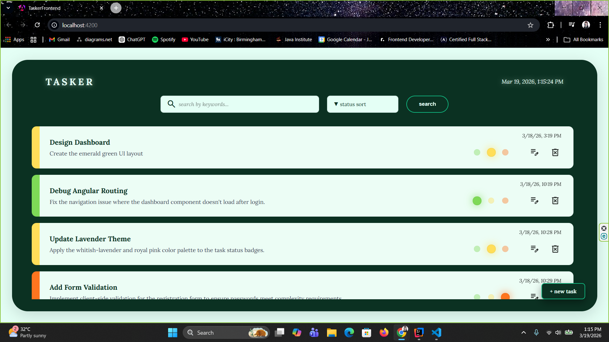
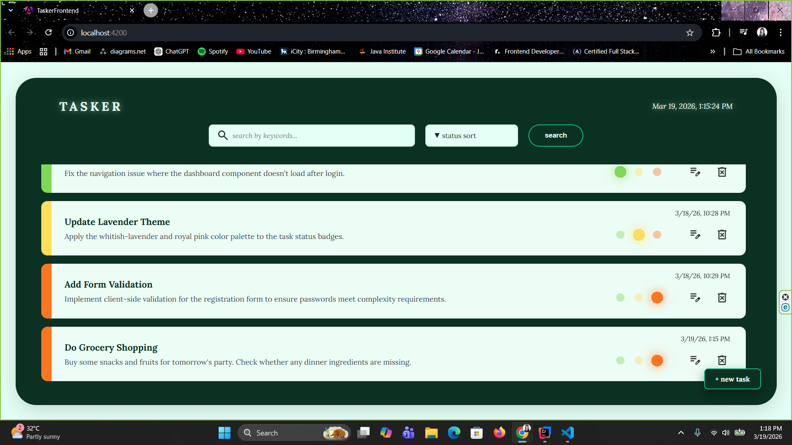  
*Overview of tasks with status indicators and date/time tracking.*

### 2. Add Task
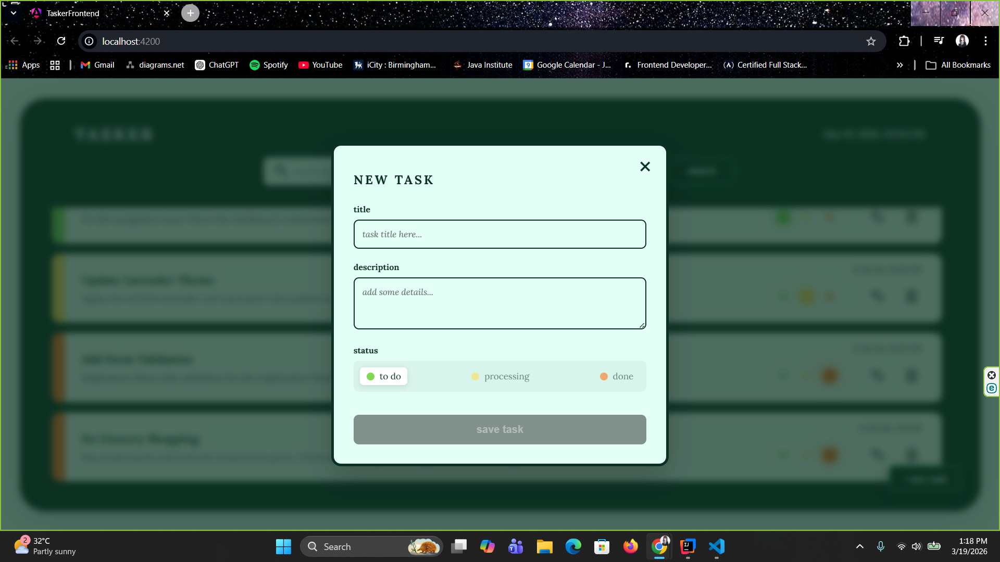   
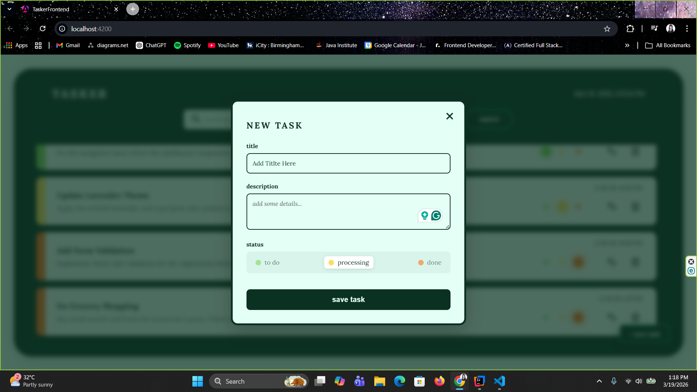   
*Creating a new task with mandatory title field and default status TODO.*

### 3. Update Task
   
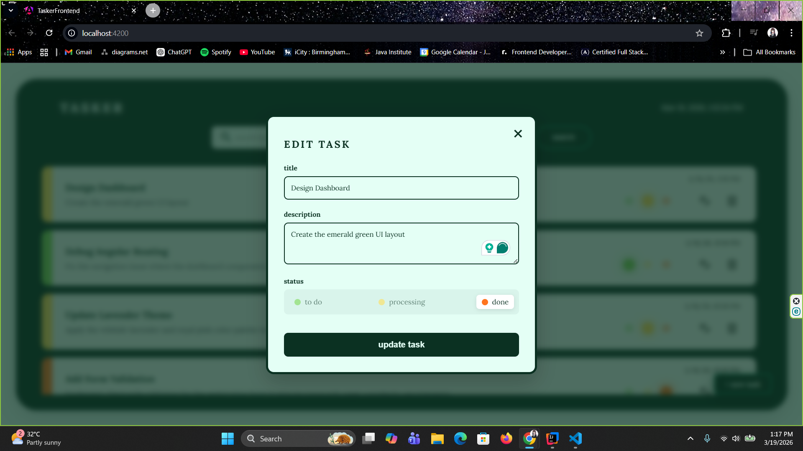   
*Modify task details and status through a simple interface.*

### 4. Delete Task
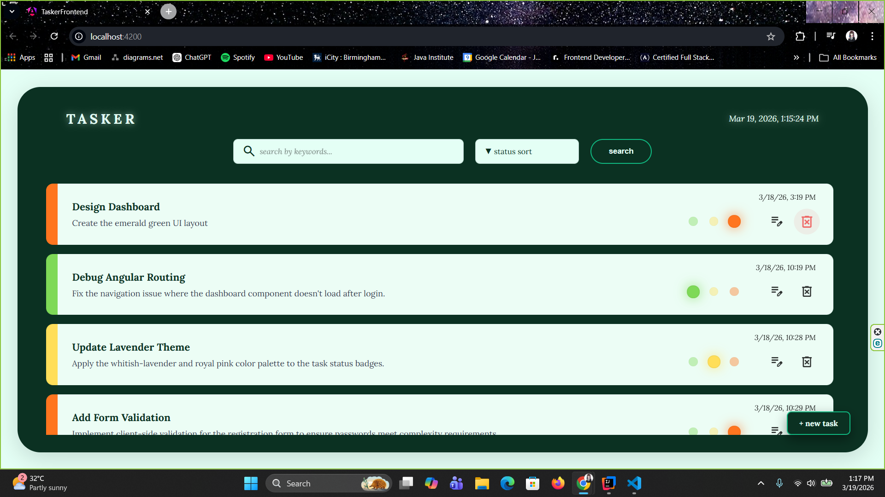   
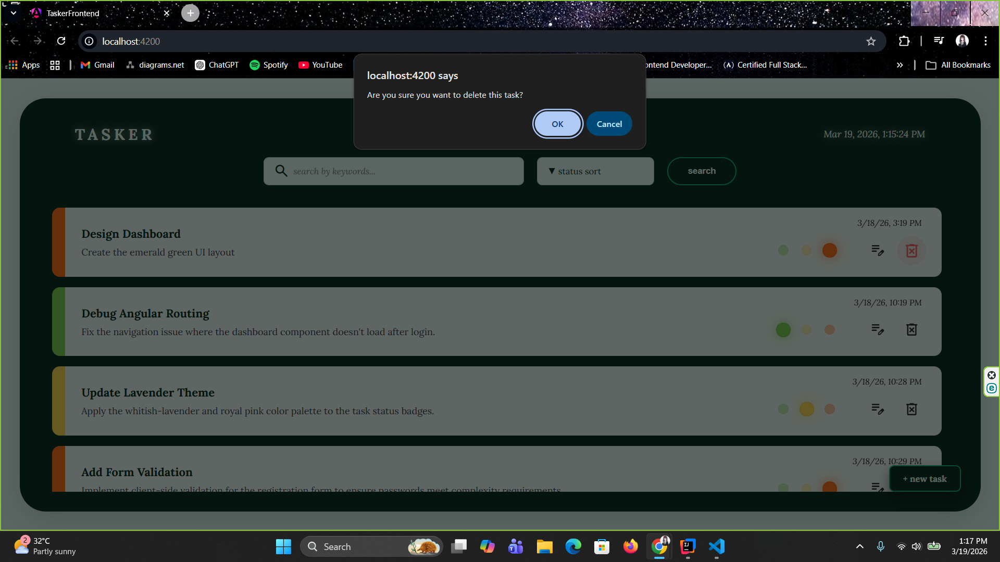    
*Remove unwanted tasks quickly.*

### 5. Search & Filter
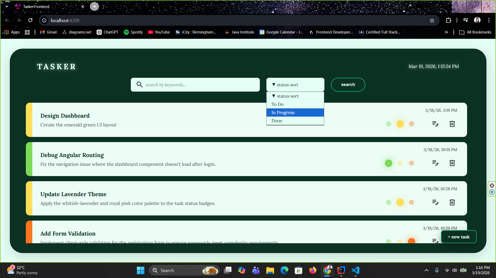    
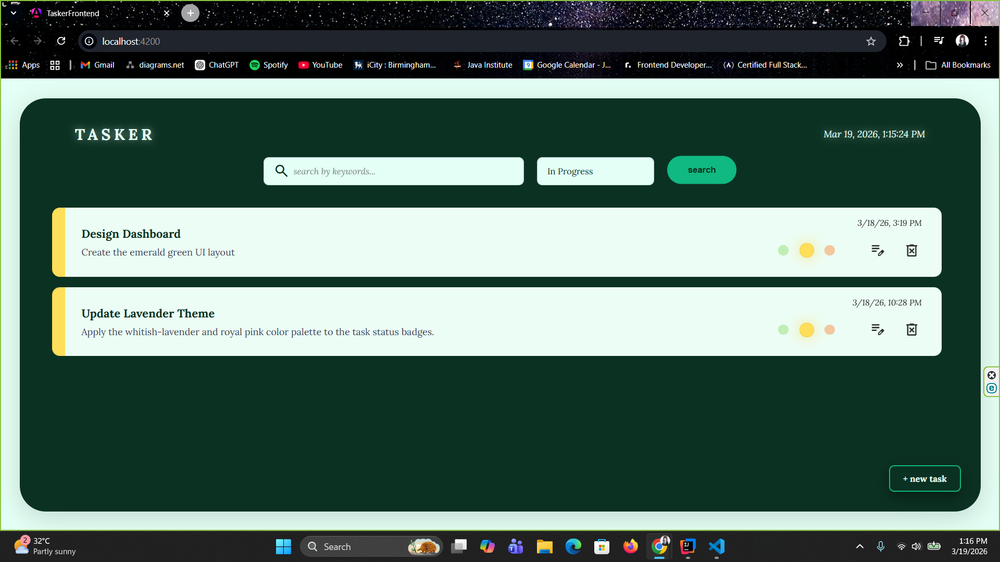    
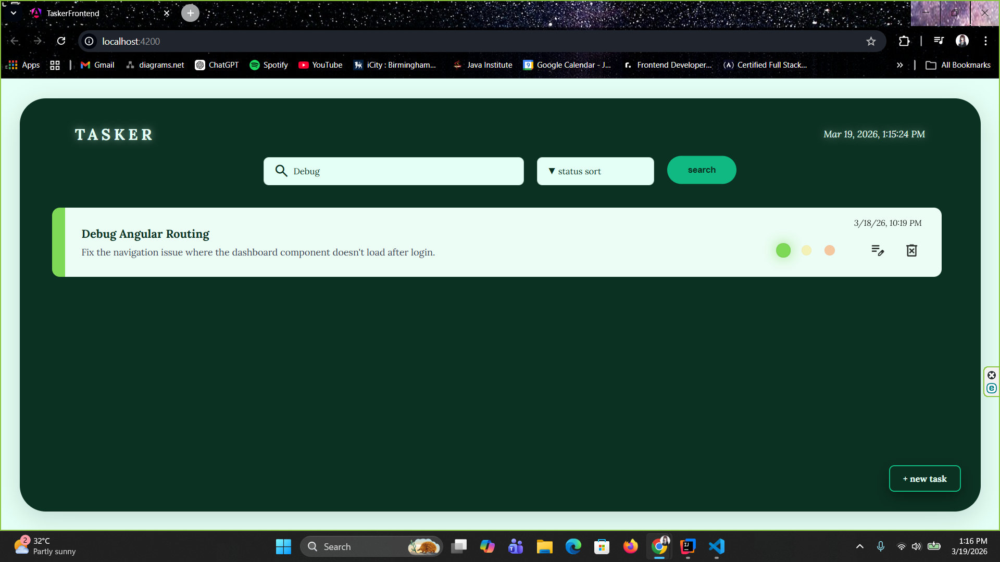    
*Search tasks using case-insensitive keywords and filter by status (TODO, In Progress, Done).*

### 6. Combined Search
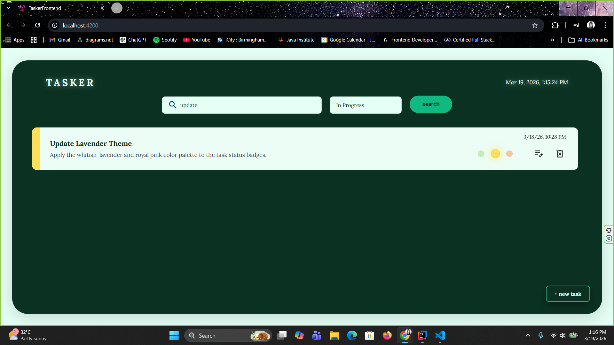    
*Search using both keywords and status for precise results.*

Demo video will be added soon.  

## Developer
**S. A. Thedara Sasindi**  
Email: thedarasasindi@gmail.com

